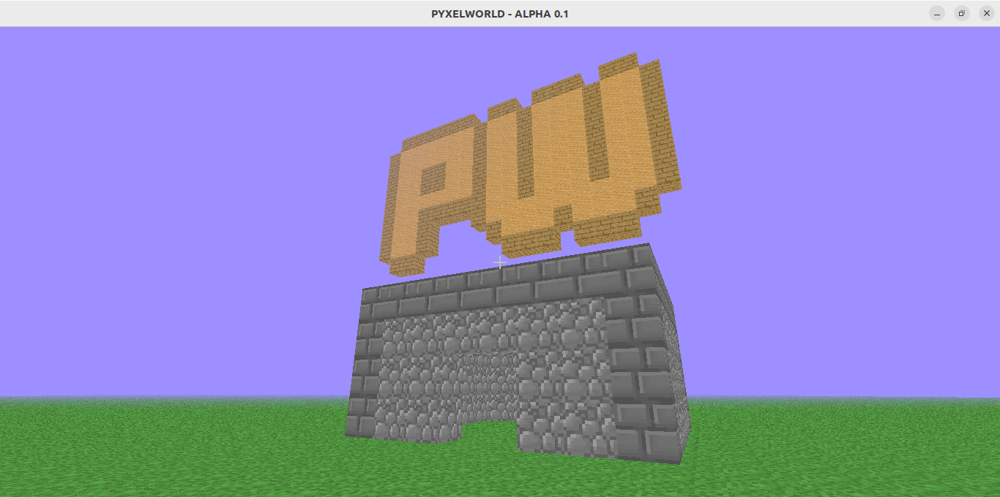

# PYXELWORLD

PYXELWORLD is a Minecraft-inspired game made with Python & Pyglet

Based on fogleman's Minecraft-inspired demo (https://github.com/fogleman/Minecraft) written in Python

## Features
- Simple save/load world system

## Controls

| Key               | Function          |
| ----------------- | :---------------: |
| W                 | Move Forward      |
| S                 | Move Backward     |
| A                 | Move Left         |
| D                 | Move Right        |
| Space             | Jump              |
| Move Mouse        | Move Camera       |
| Mouse Left Click  | Destroy Block     |
| Mouse Right Click | Place Block       |
| Tab               | Toggle Fly Mode   |
| Esc               | Lock/Unlock Mouse |
| F7                | Save World        |
| F3                | Toggle Debug Info |
| F1                | Toggle UI Visibility |

## Contribuiting

If you see that you can add a new feature for improving this game, feel free to send a pull request with the changes you have made

Make sure that your code is working properly before sending it